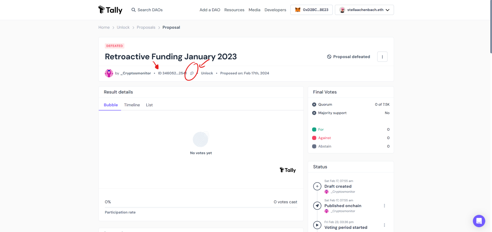
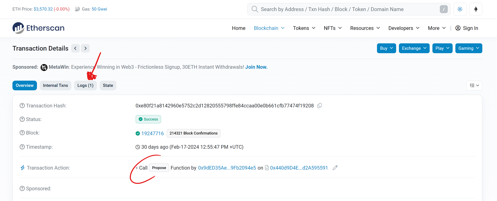
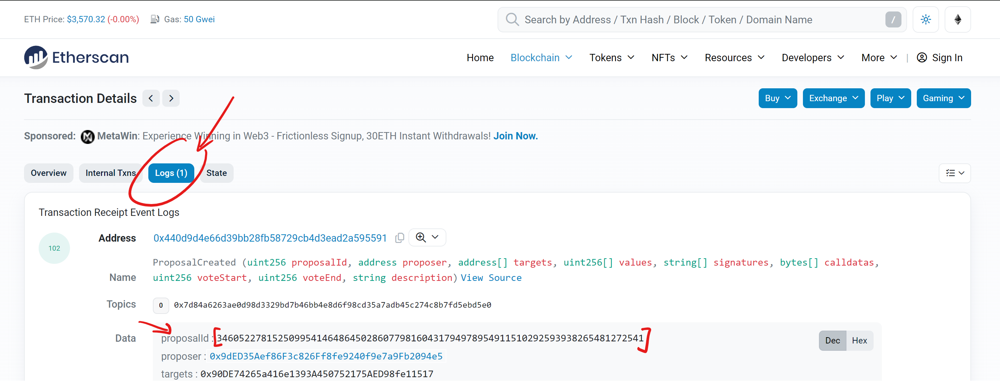
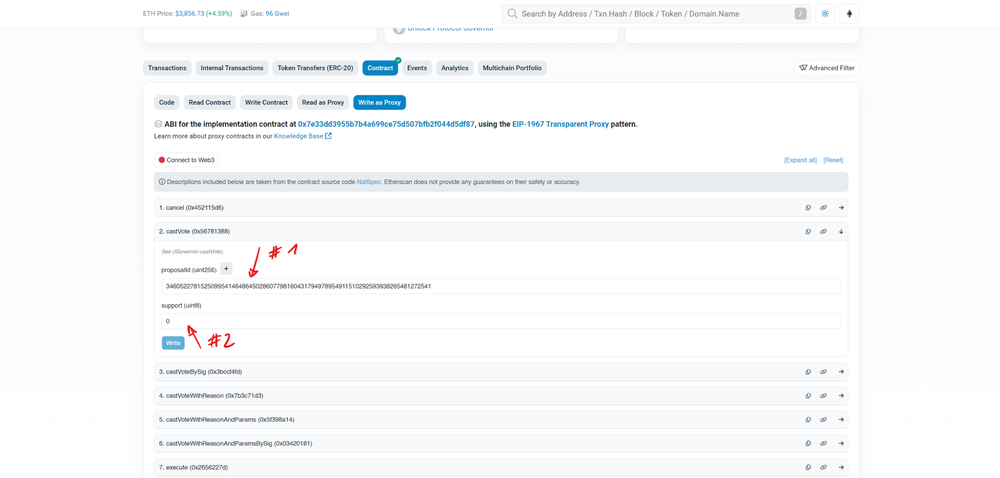

Preemable: DAO voting happens onchain. Front-ends like [Tally](https://www.tally.xyz/gov/unlock) or Etherscan are optional. They can be replaced by any UI that can interact with the contracts. Please make sure you are [familiar with the voting process](/governance/unlock-dao/#voting)!
There can be various reasons to vote through another channel. Here are the 5 steps to vote by using the Etherscan UI:

### Step 1

Get the Governor contract details from [here](https://docs.unlock-protocol.com/governance/unlock-dao/) and copy them into [Etherscan](https://etherscan.io/) and navigate to the page of the Governor contract.

### Step 2

Now head over to the “Contract” tab and select right underneath “Write as Proxy”:

### Step 3

Now, either head over to Tally and grab the Proposal ID from the proposal you wish to vote for:

Or even better, take a look at the “propose” transaction of your proposal here:

From there, navigate to the “Logs” tab to grab the proposal ID:

### Step 4

Lastly, please go ahead and return to your open Etherscan tab and paste the Proposal ID into the dedicated field under the castVote function (currently indexed 2). To vote, use the second field and enter either `0` for a vote against the proposal or `1` for a vote in favor of the proposal.

_(PS: You can also use ‘castVoteWithReason’ to add a reason for your vote.)_

Make sure you submit the transaction and you are done! You have successfully voted onchain. 🎉
