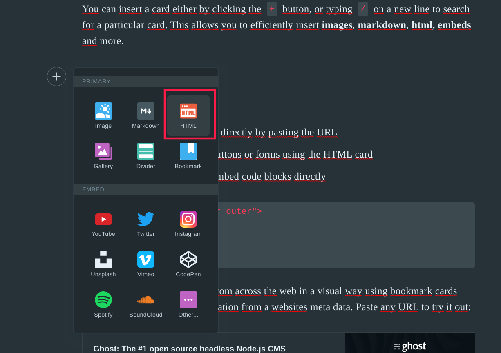
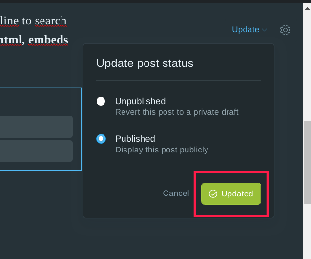

# Unlock + Ghost = <3

Unlock integration with ghost.

## Setup & Build
Install all required dependencies:

```
npm install
```

Transpile the lib:

```
npm run build
```

## Usage

In you post add a new HTML section:



Insert the following snippet and include your locks:

```
<button id='unlock'>Unlock content</button>
<script>
var unlockProtocolConfig = { 
  locks: {
    '0xebA3cc62EBA95220b2': {
      name: 'One Week'
    }, // your lock goes here
  },
  icon: 'https://staging-app.unlock-protocol.com/static/images/svg/default.svg', 
  callToAction: {
    default: 'This content is locked. Pay with cryptocurrency to access it!'
  }
}
</script>
<script src='http://pending.domain/unlock-ghost.js'></script>
```


Update your changes and now yout site is ready to support subcscriptions!


